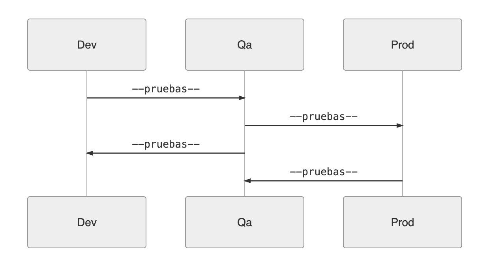
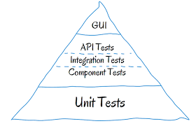

# QA challenge

Hola, bienvenid(@) a la prueba para el puesto QA Engineer, a continuación encontrarás una serie de retos que deberás realizar, ten presente que estos no son ejercicios con respuestas válidas o inválidas, es solo para conocer tus habilidades técnicas y prácticas para manejarte en diferentes situaciones que se puedan originar en el día a día laboral.

Nota: 
Primero debes crear un documento cuyo nombre tenga el siguiente formato: [qa-challenge-reto[nombre].docx] y procedé a colocar allí tus respuestas.

Leer con atención el siguiente contexto:

En el área de TI de UTP surgió la necesidad de realizar un nuevo proyecto de autenticación. El PO registro los siguientes requerimientos:

 - Nueva funcionalidad de login
 - Nueva funcionalidad de registro

### Historia de usuario
Como usuario nuevo deseo poder registrarme en la web y poder loguearme de manera satisfactoria.

### Criterios de aceptación
Los criterios de aceptación para el registro son los siguientes:

- El correo ingresado debe tener un @ para ser válido.
- La contraseña debe tener como mínimo 5 caracteres.
- El correo y la contraseña son requeridos obligatoriamente.
- El sistema debe mostrar un mensaje de error al ingresar campos no válidos.

Los criterios de aceptación para el login son los siguientes:

- El correo ingresado debe tener un @ para ser válido.
- La contraseña debe tener como mínimo 5 caracteres.
- El correo y la contraseña son requeridos obligatoriamente.
- El sistema debe mostrar un mensaje de error al ingresar campos no válidos.

El equipo de desarrollo realizo sus tareas y ahora te toca a ti certificar que dichos requerimientos se llegaron a implementar correctamente 🙌. 

** Ojo: En todos los requerimientos se debe considerar la parte front y back del sistema.

### Descarga el código

Descarga el proyecto 🗂 y levanta los servicios 🔥:

    $ git clone https://github.com/djego/recruiting-qa-challenge.git
    $ cd recruiting-qa-challenge
    $ cd back/
    $ npm run start
    $ cd ..
    $ cd front/
    $ npm run start

** En este repositorio se encuentra la parte front como la parte back del reto, cada una debe ser ejecutada por separado para comenzar con el challenge.

A continuación se hace mención de los retos:

# RETO 1

### 📌 Objetivos:
Acabas de ser incorporado al proyecto y te asignan la historia de usuario definida lineas arriba. Por consiguiente debes responder como procederías ante las siguientes circunstancias planteadas:

1. Menciona que actividades realizarías para tener un optimo proceso de control de calidad para la historia de usuario asignada.
2. ¿Cuáles son los criterios que aplicarías para poder estimar los story points de tu historia de usuario siendo un nuevo miembro del equipo?
3. Identifica y argumenta los tipos de casos de prueba que estarías aplicando para validar los requerimientos propuestos. 
4. Menciona al menos 3 tipos de técnicas de diseño de casos de prueba que usarías y describe como los estarías aplicando a tu proceso de diseño para obtener todos los casos de prueba a ejecutarse.
5. Propón una matríz para el diseño de tus casos de prueba y argumenta cual sería el motivo del orden de la ejecución.
6. Si para la ejecución de tus pruebas no cuentas con todos los accesos al proyecto y requieres del apoyo de otro miembro del equipo que se encuentra con muchos pendientes de urgencia por tanto no tiene disponibilidad para que puedan reunirse, ¿Cómo accionarías para resolver este bloqueante?.
7. Identifica, registra y describe al menos 5 bugs y 3 mejoras por requerimiento que consideres necesarios deban realizarse para que pueda darse por certifica la historia de usuario. (Eres libre de proponer una matriz y/o formato para la comunicación y gestión de los bug).
8. Si el desarrollador te indica que 3 de los bugs que reportaste no aplican, ¿Cómo procederías ante esta situación?.
9. Si durante la etapa de ejecución el Product Owner solicita cambios al requerimiento solicitado,  ¿Qué considerarías tú que debes hacer?.
10. Si ya estás en el limite de la fecha programada para la entrega de tu historia de usuario y hay presión para que esta fecha se cumpla ¿Cómo procedes a actuar ante esta situación?

Nota: Puedes utilizar las herramientas que consideres necesarias para ejecutar los tipos de pruebas que definiste en el punto 3, de tal manera que se pueda garantizar la certificación de la historia de usuario asignada. 

# RETO 2
### Agile testing 

### 📌 Objetivos:
El proyecto considera necesario incorporar pruebas automatizadas por ello te solicitan proponer un proceso para poder iniciar con la automatización teniendo en cuenta las siguientes consideraciones:

1. Establecer a modo general una estrategia de automatización y mantenibilidad.
2. Bajo los tipos de pruebas automatizadas que consideres necesarios para la historia de usuario definida lineas arriba, selecciona el framework con el que prefieras automatizar y sustenta tu elección.
3. Identificar los casos de pruebas clave de la historia de usuario modelo para automatizar e implementa la automatización con el framework seleccionado y aplicando las buenas practicas de desarrollo.

Nota: Para el proyecto de automatización deberas crear una carpeta aparte llamada [qaAutomationChallenge], subirlo a tu repositorio y enviar el link por correo. 

# RETO 3

### Entornos de trabajo y niveles de pruebas

El equipo maneja varios ambientes de trabajo (Desarrollo, QA, UAT, Produccion) a lo largo del desarrollo del producto. Consideramos que la calidad debe asegurarse en todo el flujo, por lo tanto diferentes pruebas deben realizarce en cada uno de los ambientes propuestos.

Ambientes: 

Niveles de pruebas : 

 

### 📌 Objetivos:

1. Comenta en base a tu criterio que nivel(es) de pruebas aplicarías para cada ambiente (Puedes sugerir otros ambientes u estructura si es que lo consideras)

(Coloca tus respuestas en el documento ( qa-challenge-reto[nombre].docx ))

# RETO 4

### Priorización de errores 

### Caso:
Imagina una herramienta web, desarrollada con el objetivo de proporcionar una versión de ancho de banda ligero (se requiere un uso óptimo alrededor de 50 MB) de una herramienta principalmente utilizada por personas de todo el mundo para comprar productos de segunda mano.

Defectos: 
1. Los precios no varían cuando una transacción se realiza en diferentes monedas.
2. Las transacciones entre usuarios no se reflejan en un informe de back-end.
3. Hay algunos errores ortográficos en la página de inicio.
4. Las credenciales de usuario no están cifradas en la base de datos.
5. Los foros oficiales de soporte no siempre registran los comentarios del usuario.
6. El ancho de banda necesario para una experiencia de usuario óptima es una velocidad de descarga de 100 MB.

### 📌 Objetivos:
1. Para el siguiente conjunto de defectos, prioriza del 1 al 6, siendo 1 el más crítico y explique brevemente el por qué del ordenamiento (puedes incluir alguna suposición que asumas). 
 
(Coloca tus respuestas en el documento ( qa-challenge-reto[nombre].docx ))

# RETO 5

### Agile testing 

### Caso:

La aplicación web a probar es una plataforma como Mercado Libre. A continuación, podrás encontrar una lista de técnicas y procedimientos utilizados en las pruebas

El equipo de pruebas : 
1. Utiliza el mismo entorno que los usuarios finales para realizar las pruebas perfomance.
2. Las pruebas de humo se ejecutan para cubrir todas las posibles opciones del usuario y se realizan en cada implementación de una nueva versión, todas las pruebas se realizan manualmente para reflejar la misma experiencia del usuario.
3. Las pruebas de regresión solo cubren los módulos que probablemente se vean afectados por los cambios realizados en la última versión..
4. Los casos de prueba se crean en Excel para que sean fáciles de editar. Los casos de prueba se eliminan después de la implementación de esa versión, por lo que se crean nuevos completos en cada iteración.
5. Las pruebas comienzan a estar involucradas en el proceso de desarrollo desde la etapa inicial.

### 📌 Objetivos:
1. Evalúa si los procedimientos de la lista son los más adecuados y brinda al menos 1 alternativa entre tipo de prueba o mejora que desde tu punto de vista se puede plantear a las reglas que no consideres adecuadas o se deba mejorar. 

(Coloca tus respuestas en el documento ( qa-challenge-reto[nombre].docx)) 

Recuerda enviar tu archivo al remitente que te mando la evaluación y a pao_admin@utp.edu.pe

Ante cualquier duda puedes enviar un correo a pao_admin@utp.edu.pe y estaremos encantados de ayudarte. 

Exitos y gracias por tu tiempo!😃
